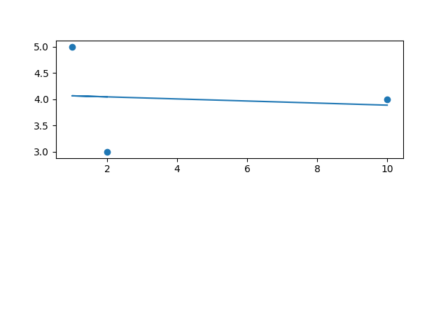

# Régression Linéaire

Représentation linéaire à partir d'un nuage de points pour estimer des valeurs futures.

On essaye d'obtenir ces estimations grâce à la formule de coût. Le but pour avoir une valeur réaliste, étant de d'avoir un coût le plus bas possible.