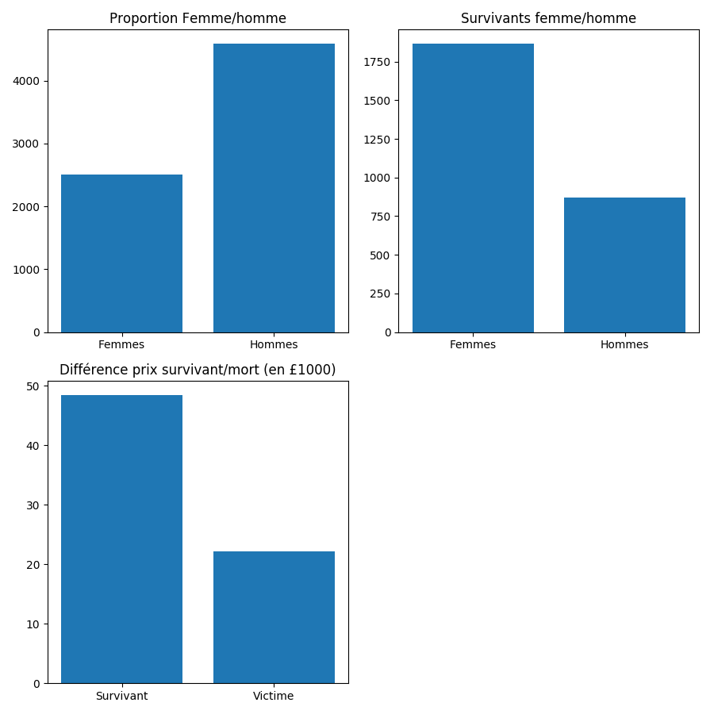

# Exercice Pandas avec des données sur le titanic.

## Proportion Femme/Homme

Les graphiques suivants montre tout d'abord la proportion d'hommes et de femmes présents sur le navire. Et aussi la proportion d'hommes et de femmes ayant survécus.

On peut constater que malgré la grande majorité d'homme présente, au final une plus grande proportion de femmes ont survécus. 

Cela montre qu'à l'époque, il y avait une certaine norme à prioriser la survie des femmes, plutôt que celle des hommes.

## Différence de "depense" en moyen entre les survivants et les morts

On peut constater que les survivants sont en moyenne plus riche, que les victimes. Cependant, ce n'est pas forcément directement lié à leur richesse. Le prix étant associé au coût de la chambre. Les chambres les moins coûteuses étaient surement plus éloignées des sorties. Ce qui explique que les personnes moins riches ont en moyenne été plus nombreuses à périr.
